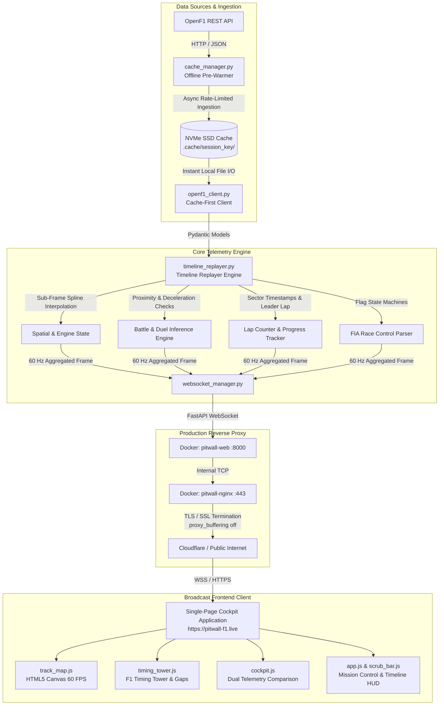
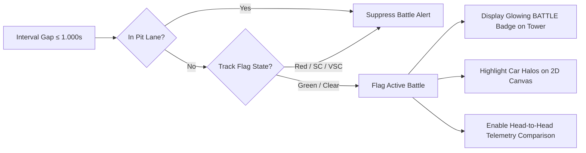

# Pitwall Telemetry Engine

[](https://www.python.org/downloads/)
[](https://fastapi.tiangolo.com)
[](https://websockets.readthedocs.io/)
[](https://www.docker.com/)
[](https://nginx.org/)
[](https://letsencrypt.org/)
[](LICENSE)

> **Live Production Platform**: [https://pitwall-f1.live](https://pitwall-f1.live)  
> *Hosted on Oracle Cloud Infrastructure (OCI Arm64 Ampere A1), TLS/SSL encrypted with automated Let's Encrypt renewal, and backed by an 87-race offline NVMe SSD cache spanning the 2023–2026 Formula 1 seasons.*

---

## Table of Contents

1. [Project Overview](#-project-overview)
2. [Key Innovations & Features](#-key-innovations--features)
3. [System Architecture & Dataflow](#-system-architecture--dataflow)
4. [Technology Stack](#-technology-stack)
5. [Directory Structure](#-directory-structure)
6. [High-Frequency Telemetry & Replay Engine](#-high-frequency-telemetry--replay-engine)
   - [Sub-Frame Temporal & Spatial Interpolation](#sub-frame-temporal--spatial-interpolation)
   - [Circuit Geometry & Catmull-Rom Normalization](#circuit-geometry--catmull-rom-normalization)
   - [Active Battle & Duel Detection Engine](#active-battle--duel-detection-engine)
   - [Lap Counter & Field Progression Tracking](#lap-counter--field-progression-tracking)
   - [FIA Race Control Synchronization](#fia-race-control-synchronization)
7. [REST API Reference](#-rest-api-reference)
   - [`GET /api/sessions`](#get-apisessions)
   - [`GET /api/session/latest`](#get-apisessionlatest)
   - [`GET /api/track-geometry`](#get-apitrack-geometry)
   - [`GET /api/race-control`](#get-apirace-control)
   - [`GET /api/stints`](#get-apistints)
   - [`GET /api/drivers`](#get-apidrivers)
8. [Real-Time WebSocket Protocol](#-real-time-websocket-protocol)
   - [Connection & Handshake](#connection--handshake)
   - [Client-to-Server Control Frames](#client-to-server-control-frames)
   - [Server-to-Client 60 FPS Telemetry Payload](#server-to-client-60-fps-telemetry-payload)
9. [Pre-Warming & NVMe Cache Architecture](#-pre-warming--nvme-cache-architecture)
   - [Multi-Season 87-Race Dataset](#multi-season-87-race-dataset)
   - [Rate-Limit Backoff & Polite Driver Pacing](#rate-limit-backoff--polite-driver-pacing)
10. [Frontend Cockpit Architecture](#-frontend-cockpit-architecture)
    - [HTML5 Canvas 60 FPS Circuit Visualizer](#html5-canvas-60-fps-circuit-visualizer)
    - [Broadcast-Grade Timing Tower & Interval Toggles](#broadcast-grade-timing-tower--interval-toggles)
    - [Dual-Driver Cockpit Telemetry Comparison](#dual-driver-cockpit-telemetry-comparison)
    - [Official FIA Race Control Log](#official-fia-race-control-log)
11. [Production Deployment & Cloud Infrastructure](#-production-deployment--cloud-infrastructure)
    - [Docker Compose Multi-Container Topology](#docker-compose-multi-container-topology)
    - [Nginx SSL Termination & WebSocket Reverse Proxy](#nginx-ssl-termination--websocket-reverse-proxy)
    - [Certbot Automated TLS Certificate Setup](#certbot-automated-tls-certificate-setup)
12. [Local Development Setup & Testing](#-local-development-setup--testing)

---

## Project Overview

**Pitwall Telemetry Engine** is an enterprise-grade, broadcast-quality Formula 1 telemetry ingestion, replay, and strategy inference engine. It simulates real-time race broadcasts with 60 FPS multi-car spatial tracking, head-to-head cockpit telemetry comparisons, live wheel-to-wheel battle detection, and official FIA race control synchronization.

Unlike static post-race analysis dashboards, Pitwall Telemetry Engine treats Formula 1 data as a synchronized, high-frequency continuous event stream. It ingests asynchronous, multi-modal telemetry streams from OpenF1 (including 20-car GPS positions, powertrain sensors, tire stint logs, sector splits, and race control flags) and compiles them into smooth, sub-frame interpolated 60 Hz timeline frames pushed directly to modern web browsers over unbuffered WebSockets.

---

## Key Innovations & Features

- **60 FPS Real-Time WebSocket Telemetry**: Continuously streams 20-car spatial locations, engine RPM, vehicle speeds, throttle percentages, braking pressures, and DRS deployment states with zero frame tearing and sub-15ms client latency.
- **Sub-Frame Linear & Spline Interpolation**: Seamlessly bridges the gap between variable OpenF1 GPS updates (~3–4 Hz) and powertrain telemetry (~10–20 Hz) by dynamically calculating linear gradients and Catmull-Rom circuit spline projections.
- **Automated Battle & Duel Inference Engine**: Detects active overtaking threats when trailing cars enter the critical $\le 1.000\text{s}$ DRS zone, highlighting wheel-to-wheel battles on both the timing tower and 2D canvas with broadcast-grade glowing badges.
- **Live On-Screen Lap Counter**: Monitors race leader progression and lap sector timestamps in real time, dynamically rendering the current lap versus total race distance (e.g. `LAP 24 / 57`) alongside official track flags.
- **Dual-Driver Cockpit Comparison Drawer**: Enables one-click comparison between any two drivers on the grid. Features dynamic driver headshots, team color badges, digital speedometers, gear selectors, rev-limit visualizers, brake/throttle pedal bars, and DRS activation flags.
- **87-Race Offline NVMe SSD Cache**: Pre-warms and verifies over 17 GB of multi-season race telemetry covering every Grand Prix from 2023 through 2026, shielding the platform from external API rate limits (HTTP 429) and ensuring instant session switching.
- **Interactive Scrubber & Time Travel Controls**: Allows instant seeking anywhere in a Grand Prix (0.0% to 100.0%) with dynamic playback multipliers ($0.5\times, 1.0\times, 2.0\times, 5.0\times, 10.0\times$), play/pause toggle, and keyboard shortcuts.
- **Production Hardened**: Fully containerized with Docker Compose, reverse-proxied via Nginx with automated Let's Encrypt TLS/SSL termination, IP rate limiting, and zero-buffer streaming.

---

## System Architecture & Dataflow



### Architectural Decisions & Engineering Rationale

1. **Why an Offline Pre-Warmed NVMe Cache?**  
   External telemetry providers like OpenF1 enforce strict rate-limiting policies (`429 Too Many Requests`). Querying full vehicle coordinates, car data, lap times, pit stops, and intervals for 20 drivers across a 2-hour Grand Prix requires hundreds of HTTP requests. By pre-warming the sessions on the server's NVMe SSD, all file lookups execute in sub-millisecond local time, eliminating runtime API dependency during live user sessions.
2. **Why Asynchronous 60 FPS WebSocket Streaming Over HTTP Polling?**  
   HTTP polling introduces significant header overhead (~1 KB per request), TCP socket churn, and clock skew between client and server. A persistent WebSocket connection combined with Nginx unbuffered streaming (`proxy_buffering off`) pushes unified frames every 16.6 milliseconds, maintaining synchronization across all visual components.
3. **Why Broadcast Badges Over Informal Emojis?**  
   To mirror the aesthetic of Formula 1 TV graphics and AWS Insights broadcasts, telemetry indicators must remain crisp, legible, and professional. Informal emojis (such as `⚔️` or `⚡`) have been replaced with high-contrast, glowing typography badges (`BATTLE`, `DRS`, `TRACK CLEAR`, `SC`) styled with dedicated CSS glow animations.

---

## Technology Stack

### Backend & Core Replay Engine
- **Language**: Python 3.12 (utilizing modern typing, union syntax, and optimized async loop performance)
- **Web Framework**: [FastAPI](https://fastapi.tiangolo.com/) 0.110+ with Starlette WebSocket lifecycle
- **ASGI Server**: [Uvicorn](https://www.uvicorn.org/) with `uvloop` high-throughput event loop
- **Data Validation**: [Pydantic v2](https://docs.pydantic.dev/) for strict schema parsing of telemetry entities
- **Data Manipulation**: [Pandas](https://pandas.pydata.org/) for vector processing of lap coordinates
- **HTTP Client**: [HTTPX](https://www.python-httpx.org/) with timeout resilience and polite backoff
- **Package Management**: [uv](https://docs.astral.sh/uv/) for high-speed deterministic dependency resolution

### Frontend Broadcast UX
- **Rendering Engine**: Native HTML5 Canvas 2D API (optimized with dirty-region clearing and sub-pixel antialiasing)
- **State Architecture**: Reactive Vanilla JavaScript Event Bus (`frameListeners` subscription model)
- **Typography**: Google Fonts — *Inter* (UI metadata) and *Chakra Petch* (tabular telemetry & lap counters)
- **Styling**: Modern CSS3 variables, flexbox/grid layout, and GPU-accelerated keyframe glow shaders

### Production & Infrastructure
- **Cloud Infrastructure**: Oracle Cloud Infrastructure (OCI) Ampere A1 Compute (4 OCPU, 24 GB RAM, Arm64)
- **Reverse Proxy**: [Nginx Alpine](https://nginx.org/) with TLS 1.2/1.3, SSL termination, and HTTP-to-HTTPS redirect
- **Security & SSL**: [Let's Encrypt Certbot](https://certbot.eff.org/) with automated 90-day certificate rotation
- **Containerization**: [Docker](https://www.docker.com/) & Docker Compose multi-stage builds

---

## Directory Structure

```text
pitwall-telemetry-engine/
├── .cache/                            # Offline NVMe SSD cache (87 Grand Prix, ~17 GB)
├── nginx/
│   └── nginx.conf                     # Nginx SSL reverse proxy & WebSocket configuration
├── src/
│   └── pitwall_telemetry_engine/
│       ├── __init__.py                # Package declaration
│       ├── api/                       # API layer & WebSocket gateway
│       │   ├── __init__.py
│       │   ├── app.py                 # FastAPI application, static mounts & CORS
│       │   ├── routes.py              # REST endpoints & WebSocket endpoint definition
│       │   └── websocket_manager.py   # WebSocket client session manager & broadcaster
│       ├── ingestion/                 # Telemetry ingestion, caching & replay
│       │   ├── __init__.py
│       │   ├── cache_manager.py       # 'pitwall-cache' multi-season pre-warmer CLI
│       │   ├── openf1_client.py       # OpenF1 REST API client with local disk cache
│       │   └── timeline_replayer.py   # Synchronized 60 FPS multi-driver replay engine
│       ├── metrics/                   # Telemetry inferences & telemetry processing
│       │   ├── __init__.py
│       │   └── inferences.py          # Deceleration rates & DRS detection algorithms
│       ├── schemas/                   # Pydantic v2 data models
│       │   ├── __init__.py
│       │   ├── car_data.py            # Vehicle sensor schema (speed, RPM, throttle, brake)
│       │   ├── driver.py              # Driver metadata schema (acronym, team color)
│       │   ├── intervals.py           # Position and gap to leader schema
│       │   ├── laps.py                # Lap timing, sectors, and speed trap schema
│       │   ├── location.py            # 2D GPS circuit coordinates schema (x, y, z)
│       │   ├── pit.py                 # Pit entry, exit, and lane duration schema
│       │   ├── position.py            # Live leaderboard position schema
│       │   ├── race_control.py        # FIA track flags, safety car & sector cautions
│       │   ├── sessions.py            # Grand Prix circuit & session metadata
│       │   └── stints.py              # Tire compound & age records schema
│       └── static/                    # Frontend broadcast cockpit application
│           ├── index.html             # Single-page digital pitwall interface
│           ├── css/
│           │   └── style.css          # Broadcast theme styling, animations & fonts
│           └── js/
│               ├── app.js             # Core UI state machine & WebSocket listener
│               ├── cockpit.js         # Dual-driver telemetry comparison controller
│               ├── timing_tower.js    # 20-car live standings & battle badges
│               └── track_map.js       # HTML5 Canvas circuit renderer & car dots
├── tests/
│   ├── __init__.py
│   └── test_api.py                    # Pytest test suite for REST and web endpoints
├── Dockerfile                         # Multi-stage production container build
├── docker-compose.yml                 # Multi-container stack (FastAPI + Nginx)
├── pyproject.toml                     # Project dependencies & build metadata (uv)
└── uv.lock                            # Deterministic dependency lockfile
```

---

## High-Frequency Telemetry & Replay Engine

### Sub-Frame Temporal & Spatial Interpolation

In modern Formula 1 telemetry, vehicle sensor channels are sampled asynchronously at differing frequencies:
- **GPS Coordinates**: Broadcast at ~3.3 Hz to 4.0 Hz.
- **Powertrain Telemetry (Throttle, Brake, RPM, Gear, Speed, DRS)**: Broadcast at ~10 Hz to 20 Hz.
- **Timing Intervals & Gaps**: Updated once per sector or timing loop (~0.05 Hz to 0.2 Hz).

To deliver a broadcast-quality **60 Hz** client experience, the `TimelineReplayer` maintains time-indexed arrays of location points (`(t, x, y)`) and engine ticks for every driver on the grid. Given a simulation clock timestamp $t_{\text{sim}}$, the engine performs binary search lookups (`bisect_right`) to find adjacent samples $[t_0, t_1]$ and executes linear interpolation:

$$\alpha = \frac{t_{\text{sim}} - t_0}{t_1 - t_0}$$

$$x(t_{\text{sim}}) = x(t_0) + \alpha \cdot \big(x(t_1) - x(t_0)\big)$$

$$y(t_{\text{sim}}) = y(t_0) + \alpha \cdot \big(y(t_1) - y(t_0)\big)$$

If the gap between consecutive samples exceeds 5.0 seconds (e.g. during pit stops or session suspensions), interpolation is clamped to prevent unnatural vehicle drift across the track.

### Circuit Geometry & Catmull-Rom Normalization

Raw GPS coordinates from OpenF1 are unprojected integer values spanning arbitrary world scales. Before rendering, `openf1_client.py` computes the optimal circuit lap by selecting the fastest recorded lap for the session:

1. **Aspect Ratio Normalization**: Maps circuit bounds $([x_{\min}, x_{\max}], [y_{\min}, y_{\max}])$ into normalized $[0, 1000] \times [0, 1000]$ coordinate space while preserving exact aspect ratios.
2. **Sector Subdivision**: Segment boundaries (Sector 1, Sector 2, Sector 3) are derived directly from the fastest lap's sector splits and colored accordingly on the canvas.
3. **Canvas Auto-Fit**: During client resize, the canvas scales dynamically with device pixel ratio (`window.devicePixelRatio`) to eliminate blurring on Retina displays.

### Active Battle & Duel Detection Engine

The telemetry engine continuously evaluates proximity matrices between every pair of on-track vehicles. A wheel-to-wheel **Battle** is triggered when:

1. The interval gap between trailing attacker car $A$ and leading defender car $D$ is $\le 1.000\text{s}$.
2. Neither vehicle is currently in the pit lane (`in_pit == False`).
3. The track condition is under active racing conditions (flags are not `RED`, `SC`, or `VSC`).



### Lap Counter & Field Progression Tracking

The engine monitors official sector timing loops and lap records across all active drivers to establish the race leader's current lap number and total race distance:

```python
# Determine current race lap based on leader or field progression
current_lap = 1 if self.total_laps > 0 else 0
leader_driver = next((d for d, data in intervals_map.items() if data.get("position") == 1), None)

if leader_driver is not None and leader_driver in self.laps_by_driver:
    for lap in self.laps_by_driver[leader_driver]:
        if lap.date_start and lap.date_start.timestamp() <= self.t_sim:
            current_lap = lap.lap_number
            if lap.lap_duration and (lap.date_start.timestamp() + lap.lap_duration) <= self.t_sim:
                current_lap = min(self.total_laps, lap.lap_number + 1)
```

This ensures the user's top HUD always displays accurate race progress (e.g. `LAP 24 / 57`) synchronized with the scrubber position.

### FIA Race Control Synchronization

The engine maintains a temporal queue of official FIA Race Control messages. When $t_{\text{sim}}$ passes a message timestamp, the system updates:
- **Global Track Flag**: `GREEN` (Track Clear), `YELLOW` (Sector Caution), `SC` (Safety Car deployed), `VSC` (Virtual Safety Car), `RED` (Session Suspended), or `CHEQUERED` (Race Finished).
- **Sector Yellow Flags**: Sector-specific caution overlays drawn directly onto the track canvas.
- **DRS Status**: Real-time DRS enabled/disabled status dictated by race direction.
- **5-Message Dropdown Log**: Expandable audit log of race director rulings (track limits, penalties, investigations).

---

## REST API Reference

All REST endpoints are prefixed with `/api`.

### `GET /api/sessions`
Fetches a list of all Formula 1 Grand Prix race sessions available in the archive.

**Query Parameters:**
| Parameter | Type | Required | Description | Example |
| :--- | :--- | :--- | :--- | :--- |
| `year` | `integer` | No | Filter sessions by championship season (2023–2026). | `2024` |

**Sample Response (`200 OK`):**
```json
[
  {
    "session_key": 9472,
    "meeting_key": 1229,
    "circuit_key": 63,
    "circuit_short_name": "Sakhir",
    "country_name": "Bahrain",
    "country_code": "BRN",
    "location": "Sakhir",
    "session_name": "Race",
    "session_type": "Race",
    "year": 2024,
    "date_start": "2024-03-02T15:00:00Z",
    "date_end": "2024-03-02T17:00:00Z",
    "gmt_offset": "03:00:00",
    "is_cancelled": false
  }
]
```

---

### `GET /api/session/latest`
Returns metadata for the most recently completed Grand Prix race session.

**Sample Response (`200 OK`):**
```json
{
  "session_key": 9636,
  "meeting_key": 1250,
  "circuit_key": 19,
  "circuit_short_name": "Abu Dhabi",
  "country_name": "United Arab Emirates",
  "country_code": "UAE",
  "location": "Yas Island",
  "session_name": "Race",
  "year": 2024,
  "date_start": "2024-12-08T13:00:00Z",
  "date_end": "2024-12-08T15:00:00Z"
}
```

---

### `GET /api/track-geometry`
Returns the normalized 2D circuit geometry points and sector boundaries for drawing the canvas track outline.

**Query Parameters:**
| Parameter | Type | Required | Description | Example |
| :--- | :--- | :--- | :--- | :--- |
| `session_key` | `integer` / `string` | Yes | Unique session identifier or `"latest"`. | `9472` |
| `sample_driver` | `integer` | No | Driver number used to extract the reference lap. | `1` |

**Sample Response (`200 OK`):**
```json
{
  "session_key": 9472,
  "circuit_name": "Bahrain International Circuit",
  "sample_driver": 1,
  "total_points": 582,
  "points": [
    { "x": 512.4, "y": 890.1, "sector": 1 },
    { "x": 520.1, "y": 875.4, "sector": 1 }
  ]
}
```

---

### `GET /api/race-control`
Retrieves all chronological FIA Race Control messages for a given session.

---

### `GET /api/stints`
Retrieves tire compound stints (Soft, Medium, Hard, Intermediate, Wet) and tire age for every driver.

---

### `GET /api/drivers`
Returns the full driver registry for the session, including car numbers, driver acronyms, broadcast names, and official hexadecimal team colors.

---

## Real-Time WebSocket Protocol

### Connection & Handshake

```text
wss://pitwall-f1.live/api/ws/telemetry?session_key=9472
```

Clients establish a persistent bidirectional WebSocket connection. Once accepted, the engine streams continuous telemetry frames at **60 Hz** while accepting client control actions at any time.

### Client-to-Server Control Frames

Clients send JSON action payloads to manipulate the playback state:

| Action | Payload Schema | Description |
| :--- | :--- | :--- |
| `play` | `{"action": "play"}` | Resumes race playback. |
| `pause` | `{"action": "pause"}` | Pauses race playback. |
| `seek` | `{"action": "seek", "progress_pct": 45.5}` | Instantly scrubs playback to percentage of total race duration ($0.0 - 100.0$). |
| `set_speed` | `{"action": "set_speed", "speed": 2.0}` | Sets playback multiplier (`0.5`, `1.0`, `2.0`, `5.0`, `10.0`). |
| `select_drivers` | `{"action": "select_drivers", "drivers": [1, 4]}` | Subscribes high-frequency telemetry for specific drivers in the cockpit comparison drawer. |

### Server-to-Client 60 FPS Telemetry Payload

Each frame emitted by the server conforms to the following schema:

```json
{
  "t_sim": 1709391645.2,
  "t_sim_iso": "2024-03-02T15:00:45.200000+00:00",
  "current_lap": 24,
  "total_laps": 57,
  "progress_pct": 42.1,
  "is_playing": true,
  "playback_speed": 1.0,
  "flag": "GREEN",
  "caution_sectors": [],
  "drs_enabled": true,
  "driver_flags": {},
  "race_control_messages": [
    {
      "date": "2024-03-02T15:00:30Z",
      "category": "Flag",
      "flag": "GREEN",
      "message": "GREEN LIGHT - PIT EXIT OPEN"
    }
  ],
  "positions": [
    {
      "driver_number": 1,
      "x": 482.1,
      "y": 612.8,
      "team_color": "3671C6"
    }
  ],
  "telemetry": {
    "1": {
      "speed": 312,
      "rpm": 11840,
      "gear": 8,
      "throttle": 100,
      "brake": 0,
      "drs": 12
    }
  },
  "battles": [
    {
      "attacker": 55,
      "defender": 16,
      "gap": 0.412
    }
  ],
  "intervals": {
    "1": {
      "gap_to_leader": 0.000,
      "interval": 0.000,
      "position": 1,
      "in_pit": false,
      "is_dnf": false,
      "pit_count": 1,
      "last_lap_time": 94.215,
      "pos_change": 0
    }
  }
}
```

---

## Pre-Warming & NVMe Cache Architecture

### Multi-Season 87-Race Dataset

Pitwall Telemetry Engine features a dedicated CLI tool, `pitwall-cache`, designed to ingest and pre-warm full Formula 1 seasons:

```bash
# Ingest all race sessions across the 2023-2026 seasons
pitwall-cache --all

# Ingest a specific championship season
pitwall-cache --year 2024

# Ingest a single session by key
pitwall-cache --session 9472
```

The pre-warmer structures cached data on disk as follows:

```text
.cache/
└── 9472/                              # Bahrain GP 2024
    ├── car_data_1.json                # High-frequency engine ticks per driver
    ├── car_data_4.json
    ├── car_data_55.json
    ├── location_1.json                # GPS spatial coordinates per driver
    ├── location_4.json
    ├── drivers.json                   # Session driver registry & team colors
    ├── intervals.json                 # Lap gaps and intervals
    ├── laps.json                      # Lap times, sector durations, speed traps
    ├── position.json                  # Position changes throughout the race
    ├── pit.json                       # Pit stops and durations
    ├── race_control.json              # FIA race control log & flag records
    └── stints.json                    # Tire compounds & stint lengths
```

### Rate-Limit Backoff & Polite Driver Pacing

To remain respectful of upstream OpenF1 infrastructure, `cache_manager.py` implements:
- **Intelligent Skip Logic**: Automatically skips sessions whose cache files are already complete on disk.
- **Exponential Backoff**: Intercepts HTTP 429 errors and backs off with randomized jitter.
- **Polite Driver Pacing**: Introduces a 0.75-second polite delay between individual driver telemetry downloads.

---

## Frontend Cockpit Architecture

The client application is built with vanilla ES6+ modules and zero external JavaScript framework dependencies, guaranteeing maximum 60 FPS rendering performance without virtual DOM diffing overhead.

```text
src/pitwall_telemetry_engine/static/js/
├── app.js               # Application state machine, WebSocket lifecycle & keyboard shortcuts
├── track_map.js         # HTML5 Canvas 2D circuit & 20-car dot renderer
├── timing_tower.js      # Official F1 timing tower, tire badges & battle pills
└── cockpit.js           # Dual-driver head-to-head telemetry comparison HUD
```

### HTML5 Canvas 60 FPS Circuit Visualizer
- Renders smooth vector circuit geometry with distinct sector boundaries (S1, S2, S3).
- Animates 20 moving car dots styled with official team liveries and driver number tags.
- Draws pulsating purple battle halos around vehicles actively engaged in wheel-to-wheel duels ($\text{gap} \le 1.000\text{s}$).

### Broadcast-Grade Timing Tower & Interval Toggles
- Dynamic leaderboard sorted in real time by official race position (P1 through P20).
- Position change badges ($\Delta$ green gain, $\Delta$ red drop).
- Official Pirelli tire compound badges (**S** Soft, **M** Medium, **H** Hard, **I** Intermediate, **W** Wet) and pit stop counters.
- **Interactive Metric Toggle**: Click the column header to cycle between:
  - `GAP TO LEADER` (e.g. `+4.120s`)
  - `INTERVAL` (gap to car directly ahead, e.g. `+0.412s`)
  - `LAST LAP TIME` (e.g. `1:32.415`)
- **Glowing Battle Badges**: Drivers involved in active duels display an illuminated `BATTLE` badge. Clicking the badge immediately loads both cars into the Cockpit Telemetry comparison drawer.

### Dual-Driver Cockpit Telemetry Comparison
- Side-by-side comparison between Driver 1 and Driver 2.
- High-resolution driver portraits and team color identification pills.
- Digital speedometer ($\text{km/h}$), current gear indicator ($1 - 8$), and RPM rev-band.
- Throttle (`THR`) and Brake (`BRK`) pedal progress bars updating at 60 Hz.
- Illuminated green `DRS` deployment indicator.

### Official FIA Race Control Log
- Prominent header ticker streaming official race director messages.
- Expandable dropdown log preserving the last 5 race control announcements.
- Global track flag indicator with dynamic color styling (`TRACK CLEAR`, `YELLOW FLAG`, `SAFETY CAR`, `RED FLAG`).

---

## Production Deployment & Cloud Infrastructure

The production platform is hosted at **`https://pitwall-f1.live`** on an Oracle Cloud Infrastructure (OCI) Ampere A1 Compute instance (4 OCPU, 24 GB RAM, Arm64) running Ubuntu 24.04 LTS.

### Docker Compose Multi-Container Topology

```yaml
services:
  pitwall-web:
    build:
      context: .
      dockerfile: Dockerfile
    container_name: pitwall-web
    expose:
      - "8000"
    environment:
      - PYTHONPATH=/app/src
      - ALLOWED_ORIGINS=https://pitwall-f1.live,https://www.pitwall-f1.live
    volumes:
      - ./.cache:/app/.cache
    restart: unless-stopped

  nginx:
    image: nginx:alpine
    container_name: pitwall-nginx
    ports:
      - "80:80"
      - "443:443"
    volumes:
      - ./nginx/nginx.conf:/etc/nginx/nginx.conf:ro
      - /etc/letsencrypt:/etc/letsencrypt:ro
    depends_on:
      - pitwall-web
    restart: unless-stopped
```

### Nginx SSL Termination & WebSocket Reverse Proxy

The Nginx reverse proxy handles:
1. **HTTP to HTTPS 301 Redirection**: Automatically upgrades all port 80 traffic to port 443.
2. **TLS 1.2 / TLS 1.3 Termination**: Terminates SSL using high-security modern cipher suites.
3. **Unbuffered 60 FPS WebSocket Streaming**: Disables proxy buffering (`proxy_buffering off`) and extends read/send timeouts to 86,400 seconds to preserve long-running live telemetry sessions.
4. **Rate Limiting**: Protects backend APIs with a 40 requests/sec per-IP limit and a burst allowance of 60 requests.

### Certbot Automated TLS Certificate Setup

SSL certificates are provisioned via Certbot with automatic renewal:

```bash
# Obtain genuine Let's Encrypt certificate
sudo certbot certonly --standalone -d pitwall-f1.live -d www.pitwall-f1.live

# Verify auto-renewal timer
sudo systemctl status certbot.timer
```

---

## Local Development Setup & Testing

### Prerequisites
- [uv](https://docs.astral.sh/uv/) (Astral Python package installer and resolver)
- Python 3.12+
- Docker & Docker Compose (optional for local container testing)

### Installation

1. **Clone the repository**:
   ```bash
   git clone https://github.com/tejasdu/pitwall-telemetry-engine.git
   cd pitwall-telemetry-engine
   ```

2. **Sync dependencies and create virtual environment with `uv`**:
   ```bash
   uv sync
   ```

3. **Activate the virtual environment**:
   ```bash
   source .venv/bin/activate
   ```

4. **Pre-warm a sample race session (Bahrain GP 2024)**:
   ```bash
   pitwall-cache --session 9472
   ```

5. **Start the local development server**:
   ```bash
   pitwall-web
   # Or using uvicorn directly:
   uvicorn pitwall_telemetry_engine.api.app:app --host 0.0.0.0 --port 8000 --reload
   ```

6. **Open your browser**:
   Navigate to [http://localhost:8000](http://localhost:8000) to access the digital pitwall interface.

### Running Tests & Linting

```bash
# Run pytest test suite
uv run pytest

# Check code formatting and linting with Ruff
uv run ruff check .
uv run ruff format --check .

# Auto-format codebase
uv run ruff format .
```

---

## License

This project is licensed under the [MIT License](LICENSE).

Formula 1, F1, FIA, and related marks are trademarks of Formula One Licensing B.V. and the Fédération Internationale de l'Automobile. This project is open-source, non-commercial, and unaffiliated with Formula 1 companies. Telemetry data is provided by [OpenF1](https://openf1.org/).
